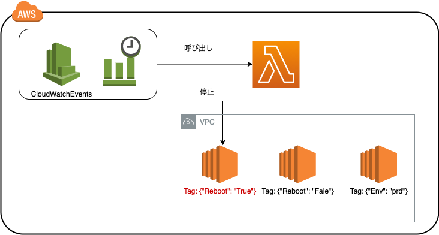

# 特定のタグ付きEC2を自動でシャットダウンするLamdba関数



## ユースケース

- 開発環境のEC2などを決まった時間に停止する
  - 平日の深夜
  - 休日など

決まった時間に関してはAWS CloudWatchEventsで呼び出しを行う

デプロイ自動化等は別途調整

## デバッグ方法

`docker-compose-up` でコンテナを立ち上げる

app.pyの `lamdba-handler` 関数に実行したい処理を記載する

```py
# 例
def lambda_handler(event, context):
    return 'This is A Test'
```

この状態で以下のようにcurlコマンドを実行することで処理の実行を確認することができる

```
curl -XPOST "http://localhost:9000/2015-03-31/functions/function/invocations" -d '{}'
> "This is A Test" 
```
